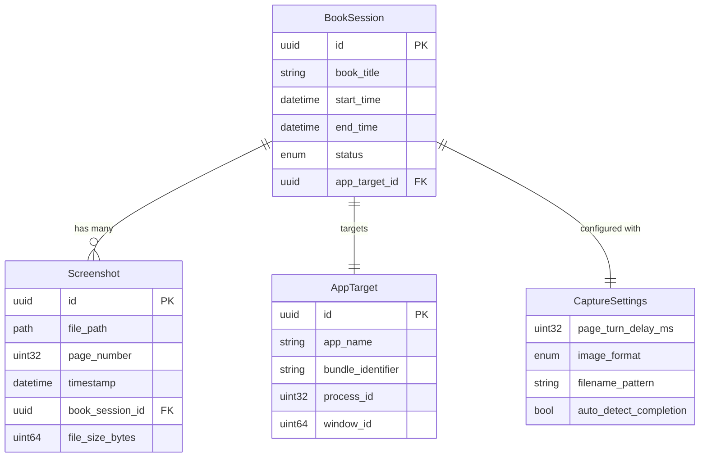

# Data Model: Automatic Book Screenshot Application

**Generated**: 2025-09-13  
**Spec Reference**: [spec.md](./spec.md)  
**Research Reference**: [research.md](./research.md)

## Overview

This document defines the core data entities, their relationships, and validation rules for the automatic book screenshot application. The model supports the capture, storage, and management of screenshot sessions for e-books.

## Core Entities

### 1. Screenshot

Represents an individual screenshot captured from an e-book page.

#### Fields
```rust
pub struct Screenshot {
    pub id: Uuid,                    // Unique identifier
    pub file_path: PathBuf,          // Absolute path to PNG file
    pub page_number: u32,            // Page number in book (1-indexed)
    pub timestamp: DateTime<Utc>,    // When screenshot was taken
    pub book_session_id: Uuid,       // Reference to parent session
    pub file_size_bytes: u64,        // Size of PNG file
    pub image_width: u32,            // Image width in pixels
    pub image_height: u32,           // Image height in pixels
    pub capture_duration_ms: u32,    // Time taken to capture (performance metric)
    pub metadata: ScreenshotMetadata, // Additional metadata
}

pub struct ScreenshotMetadata {
    pub display_scale: f64,          // HiDPI scale factor
    pub color_space: String,         // Color space (e.g., "sRGB")
    pub checksum: String,            // SHA-256 checksum for integrity
}
```

#### Validation Rules
- `page_number` must be >= 1
- `file_path` must be absolute and point to valid PNG file
- `file_size_bytes` must match actual file size
- `capture_duration_ms` should be < 5000 (5 seconds) for performance monitoring

#### State Transitions
1. **Pending** → Screenshot capture initiated
2. **Captured** → Image data obtained from ScreenCaptureKit
3. **Saved** → PNG file written to disk
4. **Verified** → File integrity confirmed
5. **Failed** → Error occurred during capture or save

### 2. BookSession

Represents a complete screenshot session for a specific book.

#### Fields
```rust
pub struct BookSession {
    pub id: Uuid,                       // Unique identifier
    pub book_title: String,             // Book title (from window or user input)
    pub start_time: DateTime<Utc>,      // Session start timestamp
    pub end_time: Option<DateTime<Utc>>, // Session end (None if in progress)
    pub status: SessionStatus,          // Current session state
    pub target_app: AppTarget,          // Target application details
    pub settings: CaptureSettings,      // Session-specific settings
    pub output_directory: PathBuf,      // Directory for screenshots
    pub total_pages_captured: u32,     // Number of successful captures
    pub total_pages_estimated: Option<u32>, // Estimated total pages (if detectable)
    pub last_page_captured: u32,       // Last successfully captured page
    pub error_count: u32,               // Number of capture errors
    pub session_summary: Option<SessionSummary>, // Final session statistics
}

pub enum SessionStatus {
    Initializing,     // Setting up session
    WaitingForStart,  // Ready, waiting for user trigger
    Capturing,        // Actively capturing screenshots
    Paused,          // User paused the session
    Completed,       // Session finished normally
    Cancelled,       // User cancelled session
    Failed,          // Session failed due to error
}

pub struct SessionSummary {
    pub total_duration_ms: u64,        // Total session time
    pub pages_per_minute: f64,          // Capture rate
    pub average_capture_time_ms: f64,   // Average time per screenshot
    pub total_file_size_mb: f64,        // Total storage used
    pub error_rate: f64,                // Percentage of failed captures
}
```

#### Validation Rules
- `book_title` must not be empty and must be valid filename
- `start_time` must be <= current time
- `end_time` must be >= `start_time` when set
- `total_pages_captured` must equal count of associated screenshots
- `output_directory` must be writable

#### Relationships
- One BookSession has many Screenshots (1:N)
- One BookSession has one AppTarget (1:1)

### 3. AppTarget

Represents the target e-book application being automated.

#### Fields
```rust
pub struct AppTarget {
    pub id: Uuid,                    // Unique identifier
    pub app_name: String,            // Application name (e.g., "Kindle")
    pub bundle_identifier: String,   // macOS bundle ID (e.g., "com.amazon.Kindle")
    pub process_id: u32,             // Current process ID
    pub window_id: u64,              // Target window ID
    pub window_title: String,        // Current window title
    pub detection_time: DateTime<Utc>, // When app was detected
    pub automation_strategy: AutomationStrategy, // How to automate this app
    pub last_interaction: DateTime<Utc>, // Last successful automation
    pub is_active: bool,             // Whether app is currently responsive
}

pub enum AutomationStrategy {
    KeyboardEvents {                 // Send keyboard events
        page_forward_key: KeyCode,   // Key to advance page (e.g., Right Arrow)
        page_backward_key: KeyCode,  // Key to go back (e.g., Left Arrow)
        modifier_keys: Vec<KeyCode>, // Modifier keys if needed
    },
    AccessibilityAPI {              // Use macOS Accessibility API
        forward_action: String,     // Accessibility action name
        backward_action: String,    // Backward action name
    },
    AppleScript {                   // AppleScript automation (fallback)
        forward_script: String,     // Script to advance page
        backward_script: String,    // Script to go back
    },
}
```

#### Validation Rules
- `app_name` must not be empty
- `bundle_identifier` must be valid reverse DNS format
- `process_id` must correspond to running process
- `window_id` must correspond to valid window
- Application must have required permissions (Accessibility API)

#### Detection Logic
1. Search for running applications with known bundle IDs
2. Filter for apps with visible windows
3. Verify window contains book content (heuristics)
4. Test automation capability before selection

### 4. CaptureSettings

Configuration settings for a screenshot session.

#### Fields
```rust
pub struct CaptureSettings {
    pub page_turn_delay_ms: u32,        // Wait time between page turns (500-10000ms)
    pub screenshot_format: ImageFormat,  // Always PNG for quality
    pub filename_pattern: String,        // Pattern for screenshot filenames
    pub auto_detect_completion: bool,    // Try to detect when book ends
    pub max_capture_attempts: u32,       // Retry attempts for failed captures
    pub keyboard_shortcuts: KeyboardShortcuts, // User-configured shortcuts
    pub storage_settings: StorageSettings, // File storage configuration
}

pub enum ImageFormat {
    PNG { compression_level: u8 },   // PNG with compression (0-9)
}

pub struct KeyboardShortcuts {
    pub start_capture: GlobalShortcut,   // Start/resume capture
    pub pause_capture: GlobalShortcut,   // Pause capture
    pub stop_capture: GlobalShortcut,    // Stop and save
    pub emergency_stop: GlobalShortcut,  // Immediate stop
}

pub struct StorageSettings {
    pub base_directory: PathBuf,         // Base directory for all sessions
    pub organize_by_date: bool,          // Create date-based subdirectories
    pub max_disk_usage_mb: Option<u64>,  // Disk usage limit
    pub cleanup_failed_sessions: bool,   // Remove incomplete sessions
}
```

#### Default Values
```rust
impl Default for CaptureSettings {
    fn default() -> Self {
        Self {
            page_turn_delay_ms: 2000,
            screenshot_format: ImageFormat::PNG { compression_level: 6 },
            filename_pattern: "page_{page:04d}_{timestamp}.png".to_string(),
            auto_detect_completion: true,
            max_capture_attempts: 3,
            keyboard_shortcuts: KeyboardShortcuts::default(),
            storage_settings: StorageSettings::default(),
        }
    }
}
```

## Entity Relationships



## Data Storage Strategy

### File System Structure
```
~/Documents/BookScreenshots/
├── sessions.db                     # SQLite database for metadata
├── [book_title_sanitized]/         # Per-book directories
│   ├── session_[uuid]/             # Per-session subdirectories
│   │   ├── page_0001_20250913_143022.png
│   │   ├── page_0002_20250913_143025.png
│   │   └── session_metadata.json   # Session backup data
│   └── session_[uuid2]/
└── temp/                           # Temporary files during capture
```

### Database Schema (SQLite)
```sql
CREATE TABLE book_sessions (
    id TEXT PRIMARY KEY,
    book_title TEXT NOT NULL,
    start_time TEXT NOT NULL,
    end_time TEXT,
    status TEXT NOT NULL,
    output_directory TEXT NOT NULL,
    total_pages_captured INTEGER DEFAULT 0,
    created_at TEXT DEFAULT CURRENT_TIMESTAMP
);

CREATE TABLE screenshots (
    id TEXT PRIMARY KEY,
    book_session_id TEXT NOT NULL,
    file_path TEXT NOT NULL,
    page_number INTEGER NOT NULL,
    timestamp TEXT NOT NULL,
    file_size_bytes INTEGER NOT NULL,
    FOREIGN KEY (book_session_id) REFERENCES book_sessions(id)
);

CREATE TABLE app_targets (
    id TEXT PRIMARY KEY,
    app_name TEXT NOT NULL,
    bundle_identifier TEXT NOT NULL,
    process_id INTEGER NOT NULL,
    window_id INTEGER NOT NULL,
    detection_time TEXT NOT NULL
);
```

## Validation and Constraints

### Business Rules
1. **Unique Page Numbers**: Within a session, page numbers should be unique
2. **Sequential Capture**: Pages should generally be captured in ascending order
3. **File Integrity**: Screenshot files must exist and be readable
4. **Session Limits**: Maximum 10,000 pages per session (performance limit)
5. **Storage Quotas**: Configurable disk usage limits per user

### Error Handling
1. **Duplicate Pages**: Log warning, overwrite previous if file smaller
2. **Missing Files**: Mark screenshot as failed, continue session
3. **Permission Errors**: Pause session, request user intervention
4. **Disk Full**: Gracefully stop session, preserve captured data

## Performance Considerations

### Database Optimization
- Index on `book_sessions.book_title` for search
- Index on `screenshots.book_session_id` for session queries
- Batch inserts for screenshot metadata

### File System Optimization
- Organize by book title to reduce directory size
- Use compression for PNG files (configurable level)
- Implement cleanup for failed/cancelled sessions

### Memory Management
- Stream file operations for large images
- Limit concurrent screenshot processing
- Use weak references for UI state updates

This data model provides a robust foundation for the screenshot application while maintaining simplicity and performance.